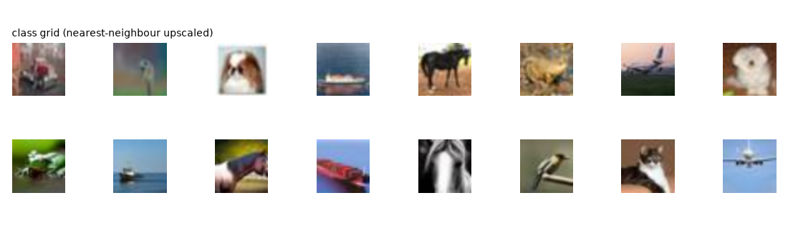

# Dataset inspection (measured, before any training)

Generated: 2026-09-11 10:05:23

## Root structure and labels

- data root: `/home/user/AMS/data`
- classes discovered from sub-directories: `['fake', 'real']`
- label mapping used for the binary task: `{'real': 0, 'fake': 1}` (1 = positive = AI/synthetic)
- images found: **20000**, validated and usable: **20000**, corrupt/unreadable: **0**
- capture groups (same source id, near-duplicate frames): **2000**
- exact duplicates (identical md5): **38**; near-duplicates inside one capture group (dhash, hamming<=2): **0**; perceptually identical copies across different capture sources: **39**
- formats: `{'JPEG': 20000}`
- dimensions: `{'32x32': 20000}`
- channels: `{'rgb': 19639, 'gray': 361}`
- class balance: `{'fake': 0.5, 'real': 0.5}` (minority/majority = 1.0)

## Per-class image statistics

| class | images | mean luma | std luma | median |laplacian| variance | median file bytes |
|---|---|---|---|---|---|
| fake | 10000 | 108.9 | 50.66 | 3509.3 | 928.0 |
| real | 10000 | 121.51 | 49.69 | 2092.1 | 924.0 |

The two classes differ measurably in **global tone** and in **high-frequency energy**. That is a shortcut a lazy classifier can exploit, so photometric statistics are removed by the per-image z-score in both the forensic descriptor and the model input, and the difference is reported here for transparency.

## Split protocol

- strategy: stratified by class, **atomic per capture group** (a group never spans two splits)
- sizes: `{'train': 14000, 'val': 3000, 'test': 3000}` (70/15/15 by image count, groups moved whole)
- seed: `13` (fixed in the run config, so the split is reproducible)
- positive (synthetic) rate per split: `{'train': 0.5, 'val': 0.5, 'test': 0.5}`
- the test split is evaluated once, after model selection; the operating threshold is fitted on validation only

## What the dataset does NOT contain

- generator fingerprinting: **not trained** - the provided dataset carries exactly one label dimension (the real/ai class folders); no per-generator sub-directories and no generator tokens in file names, so generator fingerprinting cannot be trained - it would require inventing labels
  (the second task is implemented in `ams/generator.py` and runs automatically when such folders exist; nothing was invented to make it possible here)
- no separate manipulated-face label dimension, so no second face model is trained (see model card)
- no identity annotations usable at this resolution (pixel-space 1-NN over same-source frames is at chance level)

