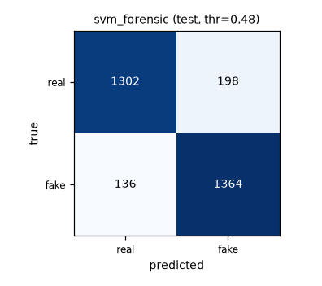
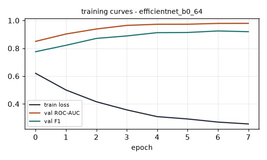
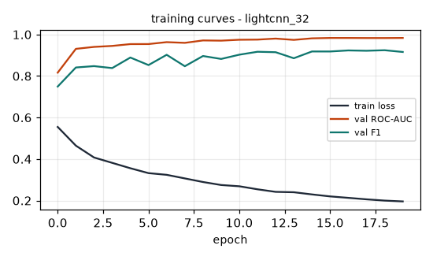
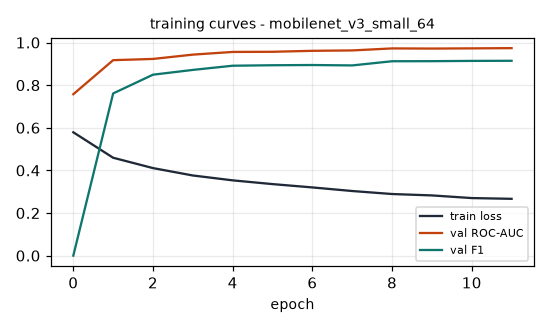
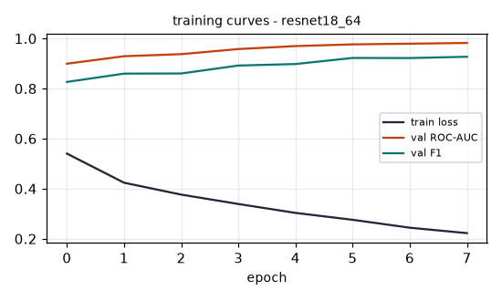
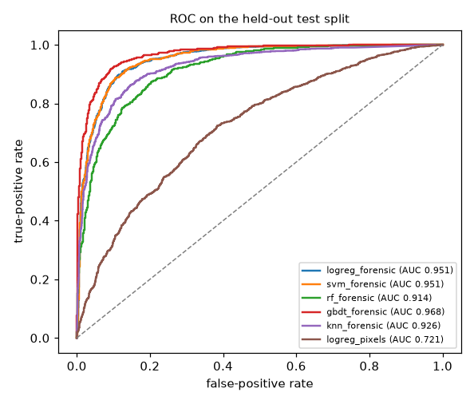

# MODEL COMPARISON

All rows are measured on the same splits with the same preprocessing. 
`Score` = 0.40*F1 + 0.25*ROC-AUC + 0.15*Accuracy + 0.10*Speed + 0.10*Efficiency.

## AI DETECTOR (binary: authentic vs AI-generated/synthetic)

| Model | Family | Accuracy | F1 | ROC-AUC | Recall | Precision | EER | Inference | Size | Score | Status |
|---|---|---|---|---|---|---|---|---|---|---|---|
| svm_forensic | classical | 0.8887 | 0.8909 | 0.9513 | 0.9093 | 0.8732 | 0.111 | 0.2 ms | 0.03 MB | 0.9275 | SELECTED |
| lightcnn_32 | deep | 0.9340 | 0.9346 | 0.9837 | 0.9427 | 0.9266 | 0.070 | 1.6 ms | 1.92 MB | 0.8615 | rank 2 |
| logreg_forensic | classical | 0.8850 | 0.8887 | 0.9511 | 0.9180 | 0.8612 | 0.109 | 0.7 ms | 0.02 MB | 0.8586 | rank 3 |
| gbdt_forensic | classical | 0.9083 | 0.9102 | 0.9684 | 0.9287 | 0.8924 | 0.090 | 1.6 ms | 1.12 MB | 0.8558 | rank 4 |
| mobilenet_v3_small_64 | deep | 0.9063 | 0.9070 | 0.9728 | 0.9140 | 0.9002 | 0.096 | 3.3 ms | 3.83 MB | 0.8316 | rank 5 |
| efficientnet_b0_64 | deep | 0.9197 | 0.9211 | 0.9768 | 0.9380 | 0.9048 | 0.080 | 7.7 ms | 16.31 MB | 0.8258 | rank 6 |
| resnet18_64 | deep | 0.9153 | 0.9151 | 0.9771 | 0.9120 | 0.9181 | 0.084 | 6.8 ms | 44.78 MB | 0.8159 | rank 7 |
| knn_forensic | classical | 0.8557 | 0.8601 | 0.9265 | 0.8873 | 0.8345 | 0.143 | 2.4 ms | 5.51 MB | 0.8010 | rank 8 |
| rf_forensic | classical | 0.8317 | 0.8337 | 0.9137 | 0.8440 | 0.8237 | 0.171 | 45.1 ms | 12.90 MB | 0.7686 | rank 9 |
| logreg_pixels | classical | 0.6123 | 0.6972 | 0.7213 | 0.8927 | 0.5720 | 0.334 | 0.2 ms | 0.02 MB | 0.7460 | rank 10 |
| rf_pixels | classical | 0.7650 | 0.7904 | 0.8673 | 0.8860 | 0.7134 | 0.215 | 45.7 ms | 18.42 MB | 0.7271 | rank 11 |

```text
SELECTED MODEL:
  svm_forensic

REASON:
  deployment score 0.9275 from F1=0.8909, ROC-AUC=0.9513, accuracy=0.8887, 0.2
   ms/image, 0.03 MB; beats runner-up lightcnn_32 (0.8615) by 0.0660.
```

Selection uses the weighted deployment score, not raw accuracy: a model is only promoted when it also pays for itself in inference time and artifact size. Full metric payloads (`log_loss`, `brier`, `mcc`, `pr_auc`, confusion matrices) live in ``models/metrics.json``.

## Thresholds chosen on validation (applied to test once)

| Model | threshold | EER | PR-AUC |
|---|---|---|---|
| svm_forensic | 0.482 | 0.1110 | 0.9387 |
| lightcnn_32 | 0.839 | 0.0697 | 0.9846 |
| logreg_forensic | 0.400 | 0.1093 | 0.9386 |
| gbdt_forensic | 0.412 | 0.0900 | 0.9680 |
| mobilenet_v3_small_64 | 0.604 | 0.0957 | 0.9734 |
| efficientnet_b0_64 | 0.625 | 0.0800 | 0.9771 |
| resnet18_64 | 0.643 | 0.0840 | 0.9786 |
| knn_forensic | 0.334 | 0.1433 | 0.9245 |
| rf_forensic | 0.495 | 0.1707 | 0.9066 |
| logreg_pixels | 0.310 | 0.3337 | 0.7094 |
| rf_pixels | 0.447 | 0.2147 | 0.8664 |

## Ablations (recorded for understanding, never eligible for selection)

| Ablation | Accuracy | F1 | ROC-AUC | Recall | Inference | What changed |
|---|---|---|---|---|---|---|
| ablate_lightcnn_64 | 0.9410 | 0.9413 | 0.9846 | 0.9453 | 3.7 ms | same lightcnn at 64px input; sources are 32x32 so 64px is an interpolated enlargement, not new detail - measures whether extra input resolution changes anything |
| ablate_lightcnn_gray | 0.9007 | 0.9010 | 0.9677 | 0.9040 | 1.5 ms | single-channel luminance input - is colour information needed at all? |

## GENERATOR CLASSIFIER (multi-class fingerprinting)

**Not trained - the dataset does not support it.**
- reason: the provided dataset carries exactly one label dimension (the real/ai class folders); no per-generator sub-directories and no generator tokens in file names, so generator fingerprinting cannot be trained - it would require inventing labels
- policy: classes are never fabricated; the UI shows generator identification as unavailable 
  rather than guessing from a binary detector output.

## FACE MODEL

- The corpus is 32x32 face crops with exactly two labels, so the trained detector *is* the face-authenticity model; a second 'deepfake face' classifier on the same two labels would be a duplicate, not evidence. 
- Face-level analysis is therefore shipped as an **analytical CV module** (`vfa.forensics`: face detection, landmark geometry, visual-consistency checks) and is labelled as such in the UI.

## Figures








